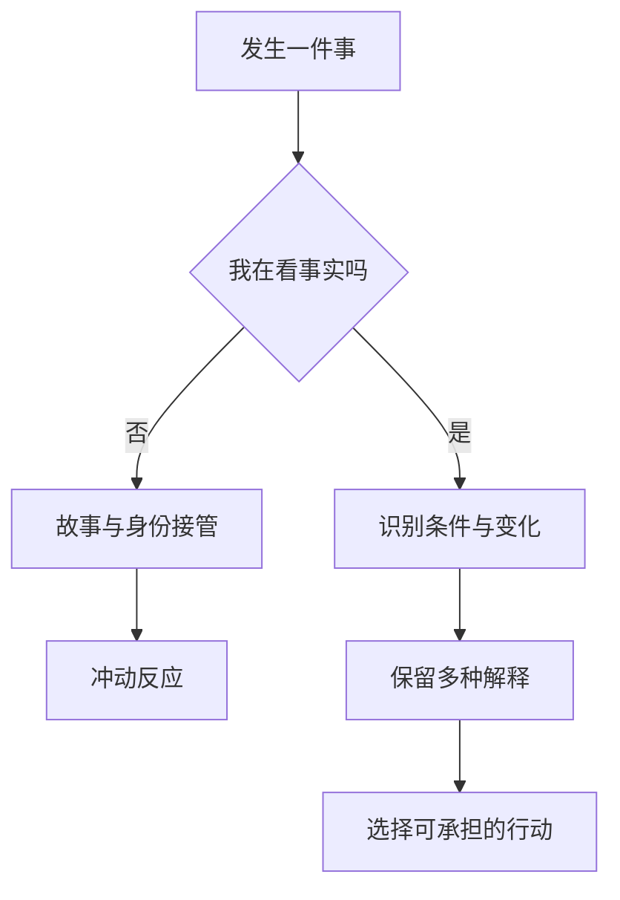

> 预计阅读时间：7 分钟

人们接近哲学，常有两个相反的期待：一种希望得到不可动摇的答案，另一种只想得到舒服的安慰。《正见》不太配合这两种期待。它做的更像一次压力测试：你珍视的东西会不会变？你的感受是否可靠？你称为“我”的东西到底在哪里？如果幸福必须依靠条件永远听话，它还能稳定多久？

## 正见不是乐观主义

乐观主义说事情可能变好；悲观主义说事情可能变坏。正见先退一步：事情会依条件变化，而我们并不知道全部条件。它既不承诺玫瑰色结局，也不把风险当宿命。

这一区别在决策中很重要。优秀投资者不需要确信市场上涨，只需要让组合在多种未来里仍可生存。成熟的职业规划不是猜中十年后的热门行业，而是积累能迁移的能力。健康的关系也不是保证“永远不会变”，而是培养变化发生时仍能对话的结构。

## 理解不等于赞同

阅读本系列时，可以把每个观念当作假设：

- 如果一切复合事物都变化，我在哪些地方假装它不会？
- 如果情绪夹带渴求，我能否在服从它之前观察它？
- 如果自我是持续更新的过程，哪些旧标签不必继续履行？
- 如果事物没有独立本质，改变条件是否比谴责对象更有效？

这是一种接近科学的态度：不因为古老而接受，也不因为古老而拒绝。概念需要在经验里拥有解释力。

> [!TIP]
> 不要问“我信不信无常”，先观察今天是否有任何感受、价格、身体状态或关系氛围完全没有变化。

## 五种现代语言

本系列会反复使用五个透镜，但不把它们强行等同：

| 透镜 | 它帮助我们看什么 |
|---|---|
| 认知心理学 | 感知、注意、记忆如何建构经验 |
| 行为经济学 | 偏误如何影响风险和选择 |
| 系统思维 | 反馈、延迟和结构如何制造行为 |
| 复杂性科学 | 涌现、不确定性与非线性 |
| 决策理论 | 在不知道结果时如何采取行动 |

佛教哲学问的是“执取如何产生与停止”；现代学科通常问“机制如何运行、怎样预测”。两者相遇的地方，是对直觉的谨慎。

## 三个应用场景

投资上，正见不是预测指标，而是提醒你：每个估值都依赖利率、增长、情绪与制度条件。工作上，它让反馈指向可调整的行为，而不是不可更改的人格。关系里，它把“你就是这样的人”改写成“在这些条件下，我们进入了这种互动循环”。

这不是语言游戏。第一种说法制造封闭身份，第二种说法暴露干预点。

## 实践：建立误差日志

连续七天，每晚记录一次“现实没有照剧本发展”的时刻：

1. 我原先预测什么？
2. 实际发生什么？
3. 我忽略了哪个条件？
4. 我是更新模型，还是保护自尊？
5. 下次最小的调整是什么？

误差日志的目的不是变得全知，而是习惯更新。理性不是从不犯错；理性是减少维护错误所需的成本。

---

## One Sentence Summary

正见不是要求你相信一套古老答案，而是训练你持续区分现实、模型与欲望。

---

## Key Takeaways

- 正见既不是乐观，也不是悲观，而是条件性的现实主义。
- 传统概念应被检验，不应因权威自动接受。
- 把人格判断改写为条件分析，会出现更多行动空间。
- 记录预测误差，是把哲学转化为认知习惯的简单方法。

---

## Reflection

1. 你最想从这套思想得到答案，还是得到安慰？
2. 哪个错误预测让你学到最多？
3. 你在哪个领域最不愿承认“不知道”？

---

## Further Reading

- Karl Popper：《猜想与反驳》
- Philip Tetlock：《超预测》
- Donella Meadows：《系统之美》

---

## Next Chapter

[作者与写作策略：用挑衅剥掉装饰](#chapter-author)
