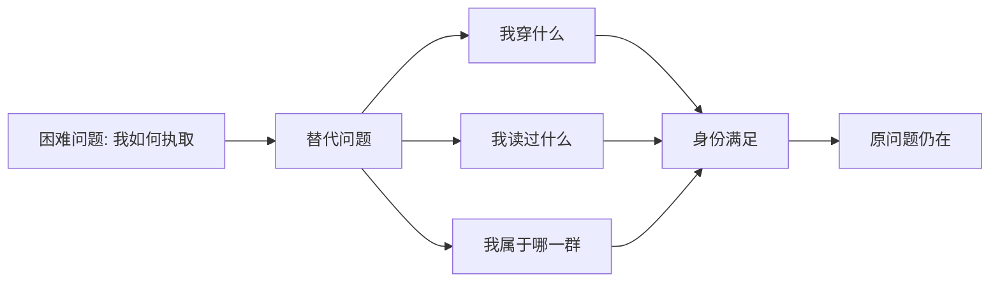

> 预计阅读时间：7 分钟

宗萨蒋扬钦哲同时具有传统佛教教师和电影导演的身份。这种组合解释了《正见》的气质：它既关心思想的正统骨架，也懂得怎样拆穿人对形象的迷恋。

## 他真正攻击的是什么

书中经常把矛头指向一种“文化拼贴”：一个人可能喜欢静坐、素食、香氛和东方美学，却从未认真面对无常、无我或执取。问题不在这些生活方式，而在于我们很容易购买一种身份，来替代困难的观察。

消费社会尤其擅长完成这次替代。商品不仅承诺功能，也出售“我是怎样的人”。知识产品同样如此：读完一本书、收藏一句话、使用一个术语，会产生已经改变的感觉。心理学把这种偏差称为替代——面对困难问题时，大脑悄悄回答一个更容易的问题。

## 四法印为何重要

作者把焦点收缩到四法印，是一种“第一性原理”策略。组织会积累仪式，学科会积累术语，个人会积累习惯；时间久了，外围做法可能比核心目的更显眼。回到四法印，就是问：如果删去建筑、服饰、国籍和仪式，还剩下什么不可删除？

这与分析企业相似。品牌故事、创始人魅力和季度新闻都可以很响亮，但长期价值仍要回到账户、现金流、竞争结构与资本配置。去掉装饰，不保证你得到真理，却能减少被装饰误导。

## 也要警惕作者效应

犀利的表达能打破陈见，也可能创造新的崇拜。一个观点听起来反常识，不等于它更深刻；一个作者敢于讽刺，不等于他不会错。成熟阅读需要同时做两件事：

- 理解作者试图解决的问题；
- 保留对论证、证据和适用范围的审查。

> [!WARNING]
> 不要用“反迷信”的姿态制造另一种迷信。把权威换成反权威，仍可能只是依赖对象发生了变化。

## 五个透镜下的作者策略

| 领域 | 可借鉴之处 | 需要保留的边界 |
|---|---|---|
| 认知心理学 | 用反例打断自动分类 | 轶事不是实验 |
| 行为经济学 | 揭示身份消费和信号行为 | 人并非只由偏误构成 |
| 系统思维 | 从仪式回到系统目标 | 传统也可能承载隐性知识 |
| 决策理论 | 区分核心原则与可选策略 | 原则仍需面对具体情境 |
| 复杂性科学 | 承认文化形式会演化 | 不能把所有形式视为噪声 |

## 现实应用

投资时，问自己买的是现金流，还是“聪明投资者”的身份。工作中，问会议、流程和头衔是否仍服务于客户价值。关系里，问你爱的是眼前的人，还是“理想伴侣”这个角色提供的自我证明。

## 实践：装饰删除测试

选一个你高度认同的身份，比如管理者、价值投资者、极简主义者。写下与它相关的十种行为，然后逐项追问：

1. 删除这项行为，核心原则还成立吗？
2. 这项行为解决真实问题，还是主要向他人发信号？
3. 如果没人知道，我还会做吗？

剩下的通常更接近你真正相信的东西。

---

## One Sentence Summary

作者最有价值的策略，是把宗教身份剥到只剩可检验的核心见地，同时提醒我们别把他的锋利风格变成新装饰。

---

## Key Takeaways

- 生活方式与思想理解不是一回事。
- 四法印是一种删除外围、寻找核心的第一性原理方法。
- 反常识表达有启发力，但不能代替论证。
- 身份信号会悄悄替代原本需要解决的问题。

---

## Reflection

1. 你在哪个领域更在意“看起来像”，而不是“实际做到”？
2. 删除哪些仪式后，你的核心原则仍然成立？
3. 哪位作者的表达风格曾让你降低了审查标准？

---

## Further Reading

- 宗萨蒋扬钦哲：《正见》
- Richard Feynman：Cargo Cult Science
- Peter Kaufman：《穷查理宝典》中的多元思维模型

---

## Next Chapter

[什么是正见：更准确地犯错](#chapter-right-view)
