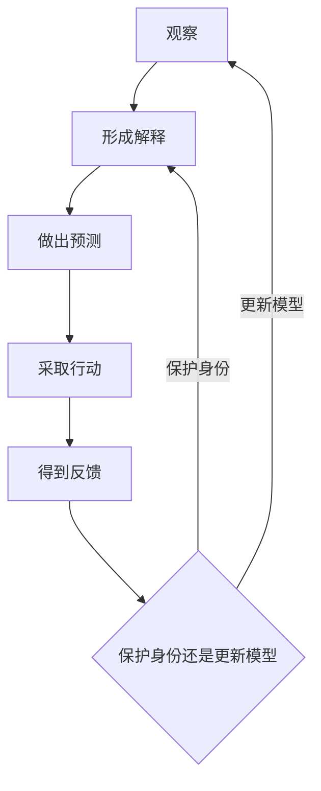

> 预计阅读时间：8 分钟

“正见”容易让人想到一张标准答案表：相信正确命题，就获得正确身份。但更有用的理解是：**正见是一种持续校准世界模型的能力。**

地图永远不等于领土。问题不是我们能否完全摆脱地图——没有模型，人无法思考——而是能否记住它只是模型。

## 从结论转向生成过程

两个人都说“这家公司很好”，可能只有一个人在运用正见。第一个因为股价上涨、朋友推荐和品牌熟悉而相信；第二个列出竞争优势、失败条件、估值假设，并知道什么证据会改变判断。结论暂时相同，认知质量完全不同。

正见关注的是这条循环能否顺畅更新。错误不可怕；不可证伪、不可修正、与身份绑定的错误才昂贵。

## 三层现实

面对任何事件，可以区分三层：

1. **观测层**：发生了什么，可被多个人核对。
2. **模型层**：哪些因果解释最可能。
3. **价值层**：我希望什么、害怕什么、愿承担什么。

争论经常是把价值伪装成事实，或把解释当成观测。“他没有立即回复”是观测；“他不尊重我”是解释；“我需要被重视”是价值。把三层分开，不会自动解决冲突，却能避免拿错工具。

## 正见与五种现代思想

认知心理学认为知觉包含预测：大脑用既有模型填补信息。行为经济学展示了锚定、确认偏误和损失厌恶。贝叶斯决策强调根据新证据调整置信度。系统思维要求观察结构与反馈，而不是寻找一个坏人。复杂性科学提醒我们，许多结果是互动涌现，无法归因于单点。

这些思想共同反对一种诱惑：**用确定感替代准确性。**

准确性不是一个静态成就。它更像持续支付的维护成本：主动寻找反例、承认置信度、记录失败预测，并允许新证据降低自信。一个人真正的认知优势，往往不是知道得更多，而是更少需要维护“我不能错”的形象。

> [!NOTE]
> 正见不保证你每次判断正确；它让错误更早暴露、代价更小、更新更容易。

## 所以呢

| 场景 | 错误模型 | 更好的问题 |
|---|---|---|
| 投资 | 好公司任何价格都值得买 | 哪个增长假设已写进价格 |
| 工作 | 这次失败证明我没能力 | 失败来自技能、策略还是环境 |
| 关系 | 对方让我生气 | 哪个期待、解释和互动共同生成情绪 |
| 学习 | 看懂就是学会 | 我能否脱离材料解释和应用 |

正见不是冷漠。相反，它让关心更有效：当你不急着证明自己正确，注意力才能转向什么真正有用。

## 正见与聪明的区别

聪明擅长生成理由，正见更关心理由能否被现实约束。高认知能力甚至可能加剧自我欺骗：一个人拥有越多知识，就越能为既有立场设计精致辩护。关键变量不是论证数量，而是证据是否可能改变结论。

考虑三个相似判断：

- “这个项目会成功，因为团队优秀。”
- “优秀团队提高成功概率，但需求、时机和分发仍是关键条件。”
- “在这些条件下我给成功率 65%；若四周后留存低于某值，就降低投入。”

第三种并不显得最确定，却最能学习。它把形容词变成假设，把信心变成投入尺度，把未来反馈写进现在的决策。

在关系里，可以把“他值得信任”改写为信任建立在哪些重复行为上；工作中，把“我适合管理”改写为在哪些团队规模和任务下表现良好。语言越接近条件，失败时越容易更新局部，而不是推翻整个世界。

## 道德判断是否也要概率化

并非所有事都应保持中立。证据充分时，需要做出明确判断和边界。正见反对的是未经检查的绝对化，不是反对立场。一个人可以承认信息有限，同时拒绝欺骗、暴力或滥用权力。谦逊描述我们知道多少，价值决定我们愿意容忍什么。

## 实践：反证清单

对一个重要判断写四句话：

- 我目前相信……
- 支持它的最强证据是……
- 反对它的最强证据是……
- 如果出现……我会改变看法。

然后给判断一个置信度，而不是“对/错”：60%、80% 或 95%。概率语言不会让世界可控，却会提醒你保留余地。

---

## One Sentence Summary

正见不是拥有无误的结论，而是让观察、解释、行动和反馈组成一个能够自我修正的循环。

---

## Key Takeaways

- 地图不可避免，但地图永远不是领土。
- 观测、解释和价值需要分开处理。
- 认知质量取决于结论如何生成、如何被反驳。
- 概率与反证能降低判断和身份之间的绑定。

---

## Reflection

1. 你最近把哪个解释当成了事实？
2. 什么证据真的会改变你最坚定的观点？
3. 你是在追求准确，还是追求确定感？

---

## Further Reading

- Julia Galef：《侦察兵思维》
- Philip Tetlock：《超预测》
- Alfred Korzybski：“地图不是领土”

---

## Next Chapter

[无常：变化不是意外，而是系统的默认值](#chapter-impermanence)
