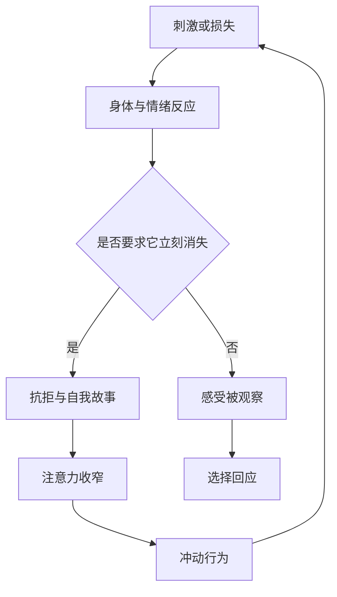

> 预计阅读时间：9 分钟

“一切情绪皆苦”很容易被误读成“人生只有痛苦”。这既不符合经验，也没有解释力。我们当然会快乐、亲近、兴奋和满足。更准确的问题是：为什么这些好感受无法提供我们要求的永久安全？

这里的“苦”更接近一种结构性的不满足：变化中的经验承担不起“必须一直如此”的任务。

## 两支箭

疼痛、失去和失败是第一支箭，它们属于生命本身。第二支箭是头脑追加的判断：“这不该发生”“只有我这么倒霉”“如果失去它，我就完了”。第一支箭未必能避开，第二支箭却常来自对现实的拒绝。



这不是责怪受苦者。长期压力、创伤、贫困和疾病都有真实影响。区分两支箭，是为了找到仍可干预的部分，不是把结构问题缩减成“心态不好”。

## 奖励系统不负责让你满足

大脑的奖励系统更擅长驱动“追求”，而不是维持“满足”。得到期待事物后，新鲜感下降，基准线调整，注意力转向下一个缺口。这就是享乐适应。

社交产品和消费系统把这个机制工业化：

1. 制造差距感；
2. 提供即时奖励；
3. 奖励很快衰减；
4. 再呈现新的差距。

渴求承诺“得到后就完整”，但它的商业模式依赖你永不完整。

> [!NOTE]
> 欲望不是敌人。问题是把欲望从信息提升为命令，再把满足推迟到它全部实现之后。

## 情绪不是事实，也不是噪声

情绪是压缩信息：它快速整合身体状态、记忆、威胁和目标。恐惧可能提醒风险，嫉妒可能暴露渴望，愤怒可能指出边界。但压缩会丢失细节，情绪也会误报。

健康的关系不是压抑或服从，而是解码：

- 我感觉到什么？
- 它保护什么需要？
- 它依据什么解释？
- 哪部分是当下，哪部分来自旧经验？
- 什么行动既尊重信息，又不被冲动接管？

## 投资、工作与关系中的苦

投资者常把浮盈迅速纳入心理资产，再把回撤体验成“失去本来属于我的钱”。工作中，晋升会短暂提高满足，很快又变成新基准。关系里，我们可能把伴侣当成情绪调节器，要求对方持续证明自己的价值。

共同结构都是：

```text
外部条件 → 短暂满足 → 新基准 → 更高要求 → 更脆弱
```

出口不是拒绝目标，而是把幸福来源从单一结果扩展到过程、能力、关系和价值。

## 满足与意义不是同一种回报

满足通常回答“我现在感觉好吗”，意义则回答“这件事是否值得承担”。照顾婴儿、学习困难技能、经营长期关系，都可能在当下带来疲惫，却仍被体验为有价值。若把所有不舒服都当作必须消除的苦，我们会失去完成困难事情的能力。

更有用的区分是：

- **必要不适**：由学习、承诺和诚实带来的成本；
- **可避免摩擦**：由糟糕流程、模糊边界和重复错误制造；
- **追加痛苦**：由“我绝不能不舒服”的要求制造。

投资研究的枯燥可能是必要不适，频繁查看价格制造的焦虑则多半可避免。一次坦诚谈话会不舒服，但长期冷战的痛苦来自失效结构。工作中的高难任务可能值得承担，持续羞辱人的文化则不应被浪漫化成成长。

> [!WARNING]
> “痛苦使人成长”不是普遍规律。只有在安全、支持、恢复和可理解的反馈存在时，不适才更可能转化为学习。

## 欲望组合，而非欲望禁令

个人可以像管理投资组合一样管理欲望：避免把全部幸福押在单一结果上，为不同时间尺度配置回报。即时快乐、长期能力、深度关系和公共价值彼此补充。目标不是没有欲望，而是不让任何一个欲望拥有无限仓位。

## 实践：延迟服从

当强烈欲望出现时，不必压制，先延迟十分钟：

1. 给身体感受命名：紧、热、空、躁动。
2. 给冲动打分：0–10。
3. 写下它的承诺：“只要……我就……”
4. 写下它的成本与替代行动。
5. 十分钟后重新评分，再决定。

练习的目标不是让欲望消失，而是在欲望与行动之间恢复选择权。

---

## One Sentence Summary

苦不是“没有快乐”，而是要求短暂、条件性的经验为我们提供永久而无条件的满足。

---

## Key Takeaways

- 生命的困难与对困难的追加抗拒需要区分。
- 享乐适应使“更多”难以成为稳定终点。
- 情绪是需要解码的信息，不是事实判决。
- 延迟服从能在冲动与行动之间重建空间。
- 真正的改善既要改变认知，也要改变造成痛苦的外部条件。

---

## Reflection

1. 你最近射向自己的“第二支箭”是什么？
2. 哪个曾经渴望的东西，如今只是生活背景？
3. 你的某种情绪正在保护什么需要？

---

## Further Reading

- Robert Sapolsky：《行为》
- Judson Brewer：《欲望的博弈》
- Laurie Santos 关于幸福科学的公开课程

---

## Next Chapter

[无我：自我是有用的界面，不是固定的实体](#chapter-no-self)
