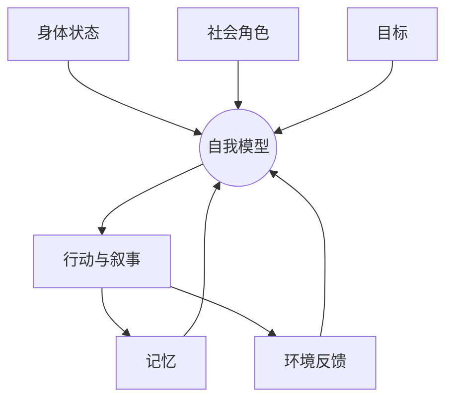

> 预计阅读时间：10 分钟

“无我”听起来像一条荒谬声明：如果没有我，谁在读这句话？谁承担责任？谁感到痛？

这种反驳针对的是“人不存在”，但无我真正质疑的是另一件事：在身体、记忆、感受、角色和选择之外，是否还存在一个独立、永久、完全主导的核心实体？

## 公司存在吗

公司有名称、账户、合同和责任，当然存在。但拆开员工、资产、制度、客户与法律关系，我们找不到一块叫“公司本体”的东西。公司的存在是约定性的、功能性的、关系性的，不是虚假的。

自我也可以这样理解：

自我是大脑整合经验、预测行为和协调社会关系的界面。界面很有用，但界面不是机器全部。

## 心智不是一位君主

现代心理学描绘的心智更像联盟：即时奖励与长期规划冲突，社会认同与个人兴趣冲突，恐惧系统和探索系统争夺控制权。我们事后常编出统一故事，仿佛所有决定都来自同一个稳定中心。

这解释了为什么“做真实的自己”有时令人困惑：你在不同时间、关系和身体状态下，会激活不同版本。问题不必是哪个版本才真，而是哪个过程更符合长期价值。

> [!TIP]
> 把“我就是拖延的人”改成“在任务模糊、反馈遥远时，我更容易拖延”。前者封死身份，后者暴露可改变的条件。

## 无我不是免责

如果自我是过程，责任反而更重要。今天的选择会塑造明天的习惯、声誉与环境。没有固定本性，不等于没有因果连续性。

一条河每刻都不是同一批水，但上游污染仍会影响下游。责任不需要永久灵魂，只需要行动与后果之间存在连续关系。

## 身份的复利与陷阱

身份能降低决策成本。“我是长期投资者”帮助你忽略噪声；“我是可靠的人”推动你履行承诺。但身份也会让证据变成威胁。当公司基本面改变，投资者可能保护“我擅长选股”的形象；当职业不再适合，人可能继续履行十年前的自我定义。

好身份应该像工具，可使用、可更新、可放下。坏身份像法庭，每个反馈都变成对人格的审判。

## 三个现实视角

**投资**：不要让持仓成为自我表达。你拥有一个判断，不是那个判断本身。

**工作**：把“职业身份”拆成能力、关系、偏好与机会。它们能重新组合。

**关系**：冲突时攻击行为而非本质。“这句话伤人”比“你是自私的人”更准确，也更可修复。

## 实践：身份拆解

完成五次句子：“我是一个______的人。”对每个答案继续写：

- 这个身份由哪些重复行为支持？
- 在什么情境下它不成立？
- 它曾保护我什么？
- 它现在限制我什么？
- 如果不用这个标签，我会怎样描述事实？

目的不是消灭自我叙事，而是恢复作者权限。

---

## One Sentence Summary

无我并不否认人的存在，而是把自我从不可改变的实体还原为由身体、记忆、关系与行动共同维持的动态模型。

---

## Key Takeaways

- 功能性存在不等于拥有独立本质。
- 心智更像多个系统的协商，而非单一君主。
- 因果连续性足以支持责任，不需要固定自我。
- 身份是有用工具，但不应成为证据无法进入的堡垒。
- 条件语言比本质标签更准确，也更可行动。

---

## Reflection

1. 哪个身份曾帮助你，如今却开始限制你？
2. 你把哪次行为反馈误听成了人格判决？
3. 如果性格可以被条件塑造，你想先改变哪个条件？

---

## Further Reading

- Thomas Metzinger：《自我隧道》
- Robert Kegan：《发展的自我》
- Stanford Encyclopedia of Philosophy：Mind in Indian Buddhist Philosophy

---

## Next Chapter

[涅槃：停止给世界加上必须](#chapter-nirvana)
