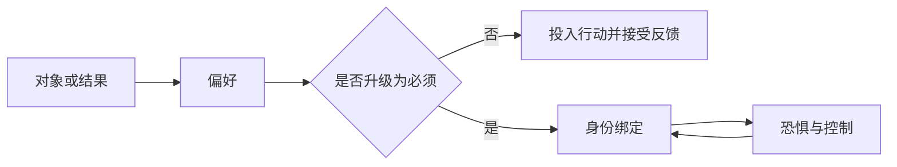

> 预计阅读时间：8 分钟

涅槃是本系列最容易被神秘化的词。把它想象成永恒幸福的天堂，会与无常冲突；把它理解为没有感受的麻木，又失去了解释痛苦的意义。

一个更克制的入口是：涅槃指向执取止息——经验仍然发生，但头脑不再要求它证明一个固定自我的安全。

## 从对象到关系

困住我们的未必是金钱、成就或关系，而是与它们建立的绝对关系：

- 没有这个结果，我就不完整；
- 这段感受必须留下；
- 这个身份不能被质疑；
- 世界必须符合我的解释。

偏好允许“我很想要，但得不到仍能生活”；执取则把愿望变成存在条件。涅槃并非删除偏好，而是停止这种升级。

## 超越概念不等于反智

概念通过划分工作：成功/失败、我/他人、拥有/失去。它们对行动必要，却会把连续现实切成固定盒子。“超越概念”不是停止思考，而是不把分类当成事物的最终本性。

一张资产负债表很有用，但不是企业；人格测评可能提示倾向，但不是一个人；一句“我们分手了”描述关系状态，却没有穷尽共同经历。

> [!NOTE]
> 自由不是不用概念，而是能使用概念而不被概念使用。

## 控制悖论

越要求不焦虑，越会监测焦虑；越要求睡着，越保持警觉；越要求投资组合每天证明自己正确，越容易追涨杀跌。试图完全控制内部经验，常形成负反馈失灵：控制动作本身维持了问题。

接纳承诺疗法称之为经验性回避。正见的语言更早指出：与感受作战，会让感受成为中心。放下不是认输，而是撤销一场无效战争。

## 行动会不会因此消失

没有执取，并不等于没有雄心。相反，结果不再承担自我价值后，行动可能更清晰：

- 投资者更愿意止损，因为承认错误不再等于自我毁灭；
- 创作者更愿意发布，因为作品评价不是人格总分；
- 伴侣更能道歉，因为输掉争论不等于失去地位。

这是“高投入、低占有”：认真做事，同时承认结果由许多条件共同决定。

## 实践：把必须降级

写下三个让你紧张的句子，找到其中隐含的“必须”：

> 我必须得到这次晋升，否则说明我失败。

依次改写：

1. **偏好**：我非常希望得到晋升。
2. **事实**：结果取决于表现、名额、关系和组织环境。
3. **价值**：无论结果如何，我重视成长与诚实反馈。
4. **行动**：我今天能改进哪一个可控变量？

降级“必须”不会降低努力，只会降低无效痛苦。

---

## One Sentence Summary

涅槃可以被理解为停止把偏好升级为存在条件，从而能够投入行动而不让结果占有自己。

---

## Key Takeaways

- 困住人的常是与对象的绝对关系，而非对象本身。
- 超越概念是看见分类的边界，不是拒绝思考。
- 强迫控制内部经验，可能反过来维持它。
- 不执取可以带来更果断而非更消极的行动。
- “高投入、低占有”是涅槃观的现实近似。

---

## Reflection

1. 哪个偏好已被你升级成了“必须”？
2. 你正在进行哪场无效的内部战争？
3. 如果结果不再定义你，你会更勇敢地做什么？

---

## Further Reading

- Steven Hayes：《跳出头脑，融入生活》
- Viktor Frankl：《活出生命的意义》
- Oliver Burkeman：《四千周》

---

## Next Chapter

[缘起：结果从来不是单一原因的作品](#chapter-dependent-origination)
