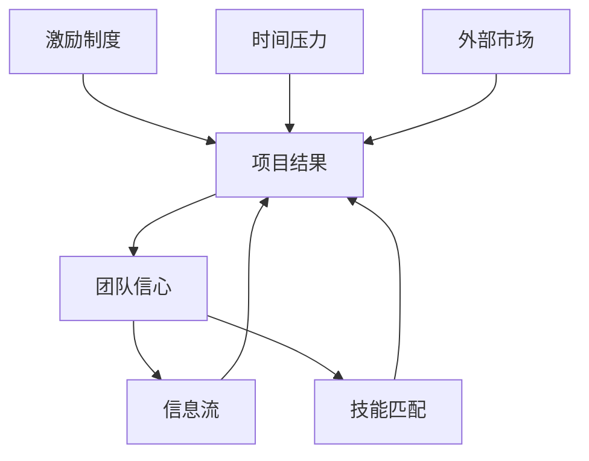

> 预计阅读时间：10 分钟

人脑偏爱单一原因。项目失败，是负责人不行；股价下跌，是一条新闻；关系冷淡，是某个人变了。单一原因让故事易懂，也给情绪一个明确对象。但在复杂系统中，结果通常由条件网络共同生成。

缘起的核心不是“一切神秘相连”，而是更朴素的判断：现象依赖条件出现，条件改变，现象也会改变。

## 从因果链到因果网

图中没有一个“唯一元凶”。更重要的是，结果会反过来改变条件：一次延期降低信心，低信心减少沟通，沟通减少又制造下一次延期。这就是反馈回路。

## 缘起不是宿命论

如果一切依条件而生，恰恰意味着没有结果注定如此。你未必能控制整个网络，却可以寻找杠杆点。

系统思维区分事件、模式和结构：

- 事件：今天又争吵了。
- 模式：每当一方疲惫，双方更容易误解。
- 结构：重要对话总发生在深夜，且没有暂停机制。

只处理事件会反复灭火；改变结构才可能改变模式。

> [!TIP]
> 当你想问“谁的错”，再加一个问题：“什么结构让这种行为反复成为最容易的选择？”

## 复杂性与谦逊

市场、组织和关系都是适应性系统：参与者会学习，也会根据预测改变行为。公开有效的策略可能因拥挤而失效；绩效指标一旦成为目标，就可能被优化到失去意义；你越监控伴侣，对方越防御，防御又被你解释为可疑。

在这类系统中，行动不是撞击静态物体，而是进入会回应你的网络。决策需要：

- 小步试验；
- 快速反馈；
- 避免不可逆的大赌注；
- 观察二阶效应；
- 在新信息出现时改变路线。

## 五个领域的缘起

**心理**：焦虑可能同时依赖睡眠、身体、压力、解释和回避行为。仅靠“想开点”太单薄。

**行为经济学**：选择受默认选项、呈现方式和社会规范影响。“意志薄弱”有时是环境设计的结果。

**投资**：收益来自价格、现金流、估值变化、持有期限与行为纪律，不能只归功于选股眼光。

**工作**：个人绩效嵌在目标、工具、协作与激励中。优秀的人进入坏系统，也可能产生坏结果。

**关系**：双方不是独立原因，而是相互触发的循环。改变自己的一个反应，可能改变整个回路。

## 实践：条件地图

选一个重复问题，在纸中央写下结果，周围至少列出：

1. 三个直接条件；
2. 两个延迟因素；
3. 一个强化回路；
4. 一个抑制回路；
5. 一个你能在七天内改变的小条件。

不要追求画得完整。地图的价值是把“本质如此”转化成“这些条件暂时如此”。

---

## One Sentence Summary

缘起让我们从寻找单一元凶转向理解条件网络，并在可改变的结构中寻找杠杆点。

---

## Key Takeaways

- 复杂结果通常由条件网络而非单一原因生成。
- 反馈会让结果反过来强化或削弱原条件。
- 条件性意味着可改变，不意味着宿命。
- 小步试验和快速反馈比精确预测更适合复杂系统。
- 结构分析不是取消个人责任，而是让责任更有效。

---

## Reflection

1. 你把哪个系统问题归咎于了一个人？
2. 当前困境中，哪个结果正在反过来强化原因？
3. 哪个小条件可能是被忽略的杠杆点？

---

## Further Reading

- Donella Meadows：《系统之美》
- Judea Pearl：《为什么》
- W. Edwards Deming 关于系统与管理的著作

---

## Next Chapter

[空性：没有独立本质，不等于什么都没有](#chapter-emptiness)
