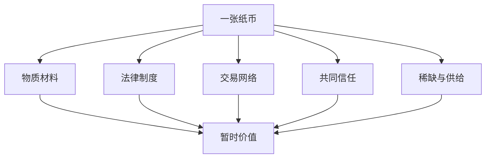

> 预计阅读时间：10 分钟

“空”是最容易被一句话毁掉的概念。若解释成“什么都不存在”，日常因果、责任和痛苦都会失去意义；若解释成某种看不见的终极实体，又把“空”变成了最不空的东西。

空的对象不是存在，而是**独立、固定、不依条件的本质**。

## 一张纸币值多少钱

纸币由纸张和油墨构成，但价值不在材料里。它依赖国家信用、法律、交易网络、共同信念与可兑换商品。说纸币“空”，不是说它买不到面包，而是说它的价值无法脱离这些关系独自成立。

公司、职位、声誉、婚姻和人格标签也具有这种关系性。它们真实地产生后果，却没有脱离构成条件的永恒核心。

## 空与缘起是一件事的两面

因为事物依条件而生，所以没有独立本质；因为没有独立本质，所以条件改变能带来变化。空不是把世界削成零，而是让因果成为可能。

一粒种子如果已经以自身力量固定地是“一棵树”，它就不需要阳光、土壤和水；如果它固定地“不是树”，任何条件也无法让它发芽。正因为结果未被本质锁死，条件才有意义。

> [!NOTE]
> 空性不是“凡事随便解释”，而是要求解释对关系、条件和层次更敏感。

## 标签为何既必要又危险

分类能压缩复杂性。医生需要诊断，投资者需要行业，组织需要职位，伴侣需要承诺。没有标签，协作成本会极高。

危险发生在标签被本质化之后：

- “他做了自私的事”变成“他本质自私”；
- “这家公司曾高增长”变成“它是成长股”；
- “我这次失败”变成“我是失败者”。

标签从导航工具变成现实监狱。空性要求我们同时保留两种视角：约定层面上认真使用，最终层面上不把它绝对化。

## 与现代思想的比较

| 现代透镜 | 相似处 | 不应混同之处 |
|---|---|---|
| 系统思维 | 属性来自关系与结构 | 主要关注可干预的系统行为 |
| 复杂性科学 | 整体性质由互动涌现 | 仍是经验科学框架 |
| 认知心理学 | 类别由心智建构 | 不直接给出空性的伦理目标 |
| 决策理论 | 模型只在条件范围内有效 | 通常不讨论主体执取 |
| 行为经济学 | 标签影响选择 | 侧重可测偏差，而非本体论 |

类比是桥，不是身份证明。

## “内在价值”还存在吗

空性容易让投资者困惑：如果没有内在本质，企业还有内在价值吗？财务语境中的“内在价值”本来就是条件模型——未来现金流、资本成本、竞争与概率的函数。它不是藏在公司内部的一块固定物质。

这不会让估值失去意义，反而要求估值者更诚实地展示假设。同一家公司在不同利率、治理和增长条件下会有不同价值区间。把单点估值当真相，是把模型的输出重新本质化。

工作价值也依情境而变。一项技能在某组织被忽视，在另一个市场可能稀缺；这既不证明你毫无价值，也不证明市场永远错误。关系中的“合适”同样不是单方属性，而是价值、阶段、沟通与现实约束的匹配。

## 反本质主义的道德收益

把人定义成“懒惰”“失败”或“危险”，会让惩罚显得自然，让改变显得不可能。条件分析迫使我们追问教育、激励、创伤、机会与具体选择。但条件分析不等于取消责任：行为造成的伤害仍然真实，边界仍需执行。

区别在于，我们惩罚或限制行为，不必把一个人宣布为永恒本质。这样既能保护受影响者，也给改变保留逻辑空间。

> [!TIP]
> 当一个判断同时解释某人的过去、现在和所有未来时，它很可能已经从描述滑向了本质化。

## 现实应用

投资中，行业分类不应遮蔽公司收入结构；“防御股”也可能因估值过高而不防御。工作中，职位不是能力边界，初级员工可能拥有高级判断，高级管理者也可能被旧经验困住。关系中，把对方从固定角色里释放出来，才有可能看到他正在变化的需要。

## 实践：寻找不存在的本质

选一个强标签，如“好公司”“坏老板”“内向的我”。回答：

1. 它由哪些可观察事实支持？
2. 去掉哪项条件，标签会改变？
3. 在什么情境下，反例已经出现？
4. 标签帮助了什么判断？
5. 标签遮蔽了什么细节？

最后把“它就是……”改写为“在这些条件和目的下，把它称为……暂时有用”。

---

## One Sentence Summary

空性否定的不是现实，而是事物能够脱离条件、关系和命名而拥有固定本质的想象。

---

## Key Takeaways

- “空”不是不存在，而是无独立自性。
- 空与缘起互相说明：正因不固定，条件才有效。
- 标签是必要的压缩工具，但不应升级为本质判决。
- 约定真实与最终分析可以同时成立。
- 类比现代科学有助理解，却不能当作概念完全等同的证明。

---

## Reflection

1. 哪个标签正在替你忽略现实细节？
2. 你对某个人的判断依赖哪些未被说明的条件？
3. 如果结果未被本质锁死，你能改变哪个条件？

---

## Further Reading

- Nāgārjuna：《中论》的现代导读
- Steven Sloman、Philip Fernbach：《知识的错觉》
- Stanford Encyclopedia of Philosophy：Madhyamaka 相关条目

---

## Next Chapter

[常见误解：正见不是消极、冷漠与虚无](#chapter-misunderstandings)
