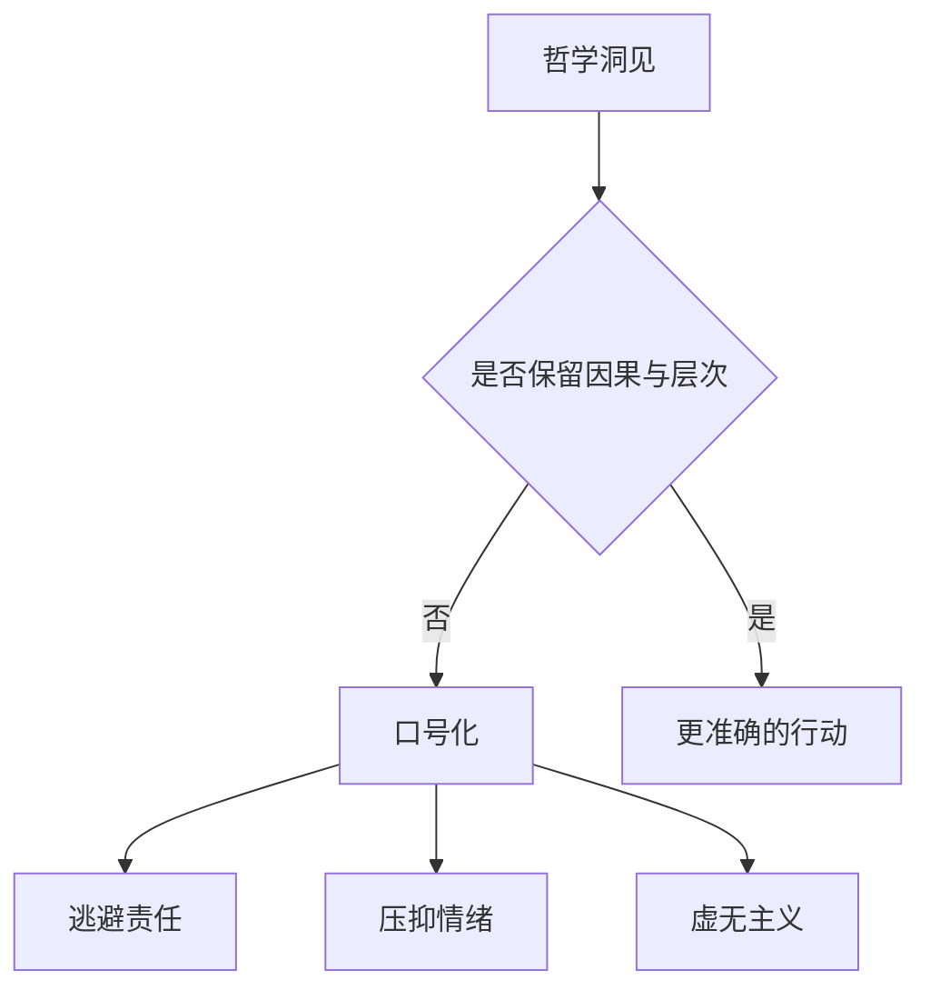

> 预计阅读时间：9 分钟

一个深刻概念最危险的命运，不是被反对，而是被廉价地接受。“一切无常”可以成为不做长期建设的借口；“无我”可以成为逃避责任的说辞；“放下执着”可以被用来要求受伤的人闭嘴。

错误应用通常来自把一个层次的洞见，搬到另一个层次使用。

## 五个常见误读

| 原概念 | 廉价误读 | 更准确的理解 |
|---|---|---|
| 无常 | 反正会变，不必认真 | 正因会变，更需维护与珍惜 |
| 苦 | 快乐都是假的 | 快乐真实，但无法承担永久保证 |
| 无我 | 没有责任主体 | 人是过程，行动仍有连续后果 |
| 空性 | 什么都不存在 | 事物依条件真实运作 |
| 不执取 | 不在乎、不投入 | 深度投入，但不占有结果 |

## 接受现实不等于认可现实

如果房子着火，承认“房子正在着火”不是赞同火灾，而是灭火的起点。否认、讨价还价或责怪宇宙都不能改变温度。接纳描述当前事实，价值判断决定下一步行动。

在关系中，“我承认你现在不愿继续”不等于“我认为这样公平”；在投资中，“市场不认可我的估值”不等于“市场永远正确”；在工作中，“组织选择了另一方案”不等于“我的方案没有价值”。

> [!WARNING]
> 不要对处在伤害中的人说“你应该放下”。安全、边界和公正属于现实条件，不能用精神语言绕过。

## 无我不等于没有边界

边界是一种因果设计：如果出现某行为，我将采取某行动。它不需要建立在固定自我上。相反，理解关系性会让边界更清楚，因为你的选择会训练系统如何对待你。

宽容如果永远没有后果，可能成为对坏行为的奖励；慈悲如果不包含判断，可能只是冲突回避。

## 无常不反对长期主义

长期主义并不依赖永久不变。园丁知道季节变化，才会在正确时间播种。投资者知道企业会衰退，才需要价格纪律和持续跟踪。伴侣知道感情不能自动保鲜，才会持续投入。

真正与无常冲突的不是承诺，而是“承诺之后无需维护”的幻想。

## 空性不允许随意解释

事物没有独立本质，不代表所有说法同样好。桥梁依条件存在，但错误计算仍会让它倒塌。解释的优劣可以由证据、预测力、一致性和后果比较。

这是一条重要中道：拒绝绝对本质，同时拒绝“什么都行”。

## 实践：口号压力测试

当你准备使用一句哲学口号时，先问：

1. 这句话是在描述事实，还是要求别人服从？
2. 它是否取消了可观察的因果？
3. 它让谁免于承担责任？
4. 如果角色互换，我还接受这个解释吗？
5. 它带来更清醒的行动，还是更方便的逃避？

---

## One Sentence Summary

正见的反面不只是不理解，也包括把深刻概念口号化，用它取消因果、边界和责任。

---

## Key Takeaways

- 接受事实与赞同事实是两回事。
- 不执取不等于低投入，无我不等于无责任。
- 边界和慈悲可以同时存在。
- 无常恰好为维护、准备和长期主义提供理由。
- 空性反对绝对本质，但不反对证据和判断标准。

---

## Reflection

1. 你曾用哪句“正确的话”逃避困难行动？
2. 谁可能借精神语言要求你容忍不该容忍的事？
3. 你的某项承诺是否建立在“不必维护”的幻想上？

---

## Further Reading

- Robert Kegan、Lisa Lahey：《免疫力改变》
- bell hooks：《爱的艺术》
- Carl Rogers：《成为一个人》

---

## Next Chapter

[现代心理学：大脑不是摄像机，而是预测机器](#chapter-psychology)
