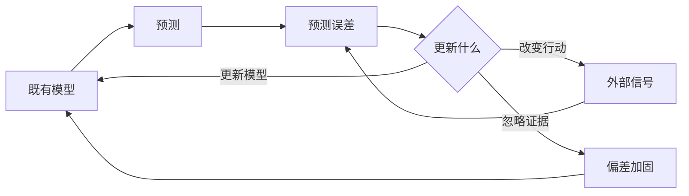

> 预计阅读时间：10 分钟

我们直觉上认为：世界先完整地进入眼睛，大脑再忠实读取。现代认知科学提供了更复杂的图景。知觉包含自上而下的预测；注意力选择少量信息；记忆在每次提取时重新建构。我们经验到的现实，是外部信号与内部模型共同生成的结果。

这与正见的相遇点很明确：感受和解释并非透明窗口。

## 预测、误差与更新

大脑可以更新模型，也可以改变行动来让世界符合预测。怀疑别人不喜欢你时，你可能减少交流；对方感到疏远，也减少回应；最初的预测因此“被证实”。这不是单纯看错，而是预测参与制造了结果。

## 偏差不是愚蠢

确认偏误、可得性启发和损失厌恶不是脑内缺陷清单。它们往往是资源有限环境中的快速策略：寻找支持证据能维持行动一致，重视损失能提高生存概率。问题在于旧策略进入了新环境。

算法提供无限信息时，确认偏误能建造封闭世界；金融市场每秒报价时，损失厌恶能制造过度交易；社交关系依赖文字时，负面解释更难被语气纠正。

正见的工作不是消灭直觉，而是知道何时不能只靠直觉。

## 情绪如何被建构

身体唤醒、情境和概念共同影响情绪。心跳加速可能被解释为恐惧、兴奋或咖啡过量。命名并非无关紧要：越精确地区分失望、羞耻、嫉妒和疲惫，越能选择对应行动。

> [!TIP]
> “我很糟糕”不是情绪名称，而是一个全局判断。尝试把它还原成身体感受、具体情绪与触发事件。

## 心理灵活性

接纳承诺疗法提出的“认知解离”与不执取有相似结构：不是删除想法，而是看见“我正在产生一个想法”。一句“我会失败”增加七个字后变成“我注意到，我正在想我会失败”。内容未变，人与内容的关系变了。

但需要保持边界：心理治疗是一套有临床研究、适应症和专业规范的方法；佛教哲学追问的范围更广。两者可以互相照明，不应互相冒充。

## 注意力如何制造“我的世界”

注意力是稀缺资源。它选择什么进入工作记忆，也影响什么被编码和回忆。连续关注威胁，世界会显得处处危险；连续关注价格，投资会缩减成波动；连续关注伴侣的缺点，关系史会被重新编辑。

这不意味着“只看积极面”。正向偏见和负向偏见都可能降低准确性。更好的练习是主动扩展采样：

- 我正在忽略什么反例？
- 哪个信息只是更醒目，而非更重要？
- 当前身体状态如何影响注意范围？
- 算法为什么选择把这条内容给我？

行为经济学中的可得性启发说明，容易想起的事件会被高估。新闻和社交媒体恰好按醒目程度竞争注意力，于是可得性不再只是个人偏差，也成为商业模式。

## 环境比意志更早行动

正见常被描述为内部观察，但外部设计同样关键。把手机放到另一个房间、默认自动储蓄、在会议前分发书面材料，都是对条件的干预。它们不要求人在每个瞬间都赢过冲动。

这连接了无我与行为设计：若行为不是固定人格的产物，改变默认选项就不是作弊，而是承认人的选择依赖环境。工作中设计清晰反馈，投资中限制交易入口，关系中约定暂停规则，都比事后责怪意志更可靠。

## 现实应用

投资者应把“这次上涨证明逻辑正确”视为待检验解释，因为价格也受流动性和叙事影响。工作中，评价应针对行为和结果，避免让一次反馈吞没全部身份。关系里，先复述对方原意再回应，可以降低预测模型对模糊信息的填充。

## 实践：三个去融合动作

1. **语言距离**：把“事实是”改为“我目前的解释是”。
2. **时间距离**：问六个月后的自己会怎样描述此事。
3. **基准率距离**：在类似情境中，一般会发生什么，而不只看眼前故事。

连续练习一周，记录哪个动作最能降低冲动，而不降低行动质量。

---

## One Sentence Summary

现代心理学提醒我们经验是信号与模型的共同产物，正见则训练我们在模型接管行动前看见它。

---

## Key Takeaways

- 知觉、注意和记忆都包含建构过程。
- 预测可能通过行为反过来制造它预言的结果。
- 偏差常是情境错配的快捷策略，不只是愚蠢。
- 给思想增加观察距离，可以改变人与思想的关系。
- 哲学与心理治疗可以比较，但不能互相替代。

---

## Reflection

1. 你的哪个预测正在通过行为自我实现？
2. 最近一次强烈感受中，身体信号和解释各是什么？
3. 哪个旧环境形成的策略，已不适合今天？

---

## Further Reading

- Lisa Feldman Barrett：《情绪是如何产生的》
- Andy Clark：《冲浪不确定性》
- Steven Hayes：《跳出头脑，融入生活》

---

## Next Chapter

[投资：在无常中管理风险，而不是预测未来](#chapter-investing)
