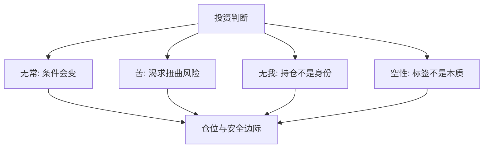

> 预计阅读时间：11 分钟

市场是检验“正见”的残酷场所。它把观点换算成损益，把执取变成仓位，把拒绝更新变成不断扩大的成本。

这不意味着佛教哲学能告诉你买什么。它提供的是更底层的纪律：资产无固定属性，价格依条件形成，情绪不等于信息，而“我是对的”不是投资目标。

## 四法印的投资翻译

**无常**要求情景分析；**苦**揭示追涨、报复性交易和永不满足；**无我**允许你不带羞耻地认错；**空性**提醒“成长股”“避险资产”都只是条件性标签。

## 风险不是波动本身

波动令人不适，却不必然等于永久损失。真正危险通常来自：

- 高杠杆导致没有等待时间；
- 单一仓位导致一次错误不可恢复；
- 流动性错配迫使低位卖出；
- 估值隐含过于完美的未来；
- 把近期价格当成基本面证据。

风险管理不是预测哪天暴跌，而是确保不知道哪天暴跌仍能生存。

## 价格是缘起的结果

价格由现金流预期、利率、风险偏好、资金约束、制度和叙事共同形成。它既不是真理，也不只是噪声。市场可以短期错得离谱，也可以比你的模型更早看见你忽略的条件。

因此，好的流程同时避免两种傲慢：

1. “市场上涨，所以我一定正确。”
2. “市场不同意，所以市场一定愚蠢。”

> [!NOTE]
> 价格是信息，不是裁决。你需要解释差异，并为自己可能错了预留生存空间。

## 无我与止损

持仓一旦成为身份，卖出就像公开承认人格缺陷。于是投资者会移动目标价、寻找只支持自己的信息，甚至加仓以证明最初判断。

预先写下退出条件，可以把未来决策从自尊保卫战还原为流程：

- 核心事实被证伪；
- 管理层行为破坏信任；
- 估值超过合理回报区间；
- 出现风险收益更优的机会；
- 仓位超过组合承受范围。

止损不只按价格，也可以按逻辑。

## 复利与不执取

长期投资需要承诺，却不需要占有结果。你能控制研究质量、费用、税收、分散和情绪纪律，不能控制下季度回报。把注意力放回可控过程，是决策理论中区分决策质量与结果质量。

一次好决策可能亏钱，一次坏决策也可能赚钱。若只按结果学习，幸运会训练出坏习惯。

## 实践：投资备忘录

每次重要投资前写一页：

| 项目 | 问题 |
|---|---|
| 核心假设 | 哪三个条件必须成立 |
| 反方论证 | 最聪明的卖方会说什么 |
| 基准率 | 类似公司通常怎样发展 |
| 失败方式 | 什么会造成永久损失 |
| 仓位 | 判断错误时能否安睡 |
| 更新触发 | 哪些证据会改变决定 |

卖出后再复盘：结果中多少来自能力，多少来自环境和运气？

> [!WARNING]
> 本章是决策框架，不构成任何证券或资产的买卖建议。

---

## One Sentence Summary

投资中的正见不是看见未来，而是在条件会变、判断会错的前提下仍能生存、更新并复利。

---

## Key Takeaways

- 市场把认知执取转化为可见成本。
- 风险管理的第一目标是避免不可恢复。
- 价格是多条件生成的信息，不是绝对裁决。
- 持仓与身份分离，才能按证据更新。
- 决策质量不能只由单次结果评价。

---

## Reflection

1. 哪个持仓最接近你的身份表达？
2. 你的组合依赖哪个未被承认的永久性假设？
3. 最近一次盈利中，有多少可能只是运气？

---

## Further Reading

- Howard Marks：《投资最重要的事》
- Annie Duke：《对赌》
- Benjamin Graham：《聪明的投资者》
- Nassim Nicholas Taleb：《随机漫步的傻瓜》

---

## Next Chapter

[工作：把职业当作不断重组的能力组合](#chapter-work)
