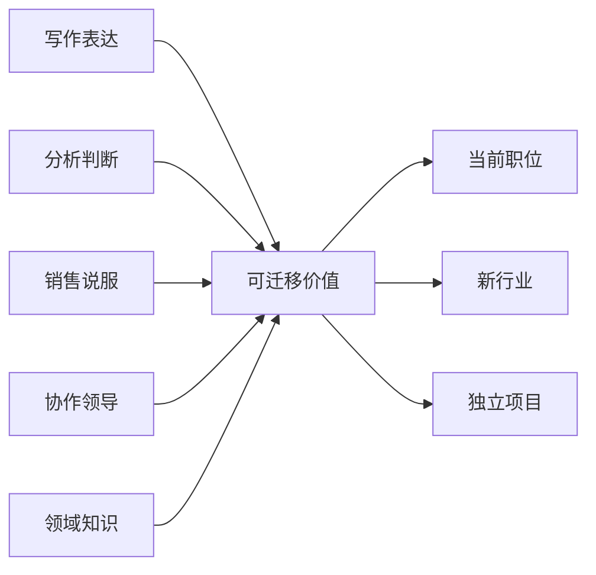

> 预计阅读时间：10 分钟

职业焦虑常被包装成能力问题，底层却可能是身份问题。我们不只害怕失去收入，也害怕无法继续回答“你是做什么的”。当职位成为自我的主要容器，组织的一次调整就会像对存在价值的否定。

正见不是让人降低事业心，而是把事业从脆弱身份改造成可演化系统。

## 头衔会过期，能力可以重组

职位是组织在特定时期对任务的打包。市场、技术和管理结构变化后，打包方式也会变化。把职业看成能力组合更稳健：

“产品经理”可能是用户研究、优先级判断、沟通、数据分析和商业理解的组合。名称会变，这些能力能在新情境重新编排。

## 绩效是缘起，不只是个人属性

同一个人在不同团队会表现迥异，因为产出同时依赖目标清晰度、反馈速度、工具、信任、激励和任务匹配。承认系统因素不是推卸责任，而是避免把全部问题都交给意志力。

可以把工作问题分为四类：

| 类型 | 典型信号 | 优先动作 |
|---|---|---|
| 技能缺口 | 知道目标但不会做 | 训练、示范、刻意练习 |
| 信息缺口 | 不知道何为成功 | 澄清标准、缩短反馈 |
| 激励错位 | 做对的事反而受罚 | 调整机制或更换环境 |
| 能量不足 | 会做但持续耗竭 | 恢复、边界、工作重设 |

用“我不够努力”解释所有问题，既残酷又低效。

## 反馈不等于身份判决

好的反馈描述行为、影响和下一步。坏反馈给人格贴标签。接受反馈时，也要做相同转换：

> “这次汇报结构不清楚”是关于一次产出的信息，不是“我没有逻辑”的终身诊断。

无我观让学习变得可能：如果能力是固定本质，练习没有意义；正因为能力由经验和条件塑造，反馈才值得认真。

## 无常下的职业策略

预测十年后的唯一正确职业很难。更可行的是构建选择权：

- 学习相邻技能，而非只优化当前流程；
- 保留公开作品和可验证成果；
- 建立跨组织关系，而非只依赖内部声誉；
- 保持储蓄，为转型购买时间；
- 用副项目测试兴趣和市场，而非一次豪赌。

这类似实物期权：用有限成本换取未来选择，而不是今天就预测全部未来。

## 不执取与卓越

不执取不是对结果无所谓，而是把自我价值与一次结果分开。这样反而更能做困难的事：主动暴露半成品、寻求批评、承认不会、终止过期项目。

工作真正的自由，不是永远做喜欢的事，而是不需要每项任务都证明你是谁。

## 组织会奖励它测量的东西

个人努力嵌在指标里。若客服只按处理速度考核，复杂问题会被转移；若研发只按功能数量评价，维护与质量会被牺牲；若管理者只追求季度数字，长期能力会成为隐性成本。这是古德哈特定律的现实版本：指标成为目标后，会逐渐失去指标价值。

正见要求员工审查自己的目标函数，也要求管理者承担系统设计责任。可以连续追问：

1. 这个指标原本代理什么真实价值？
2. 人会怎样在字面上完成它？
3. 哪项重要工作因此无人奖励？
4. 哪个副作用要在更长周期才出现？

这与投资相似：利润数字需要结合现金流和资本投入；与关系也相似：消息频率可以衡量联系，却不能独自代表亲密。

## 学习速度比知识库存更耐久

知识会过期，但建立问题、寻找反馈和迁移模型的能力能适应变化。所谓成长型思维若只剩“努力就行”，仍然不够。有效学习需要任务难度合适、反馈具体、错误可见，并有机会重复。

职业选择时，可以把薪资、头衔之外的“学习率”纳入回报：是否接触高质量问题，是否有人给真实反馈，是否拥有足够自主权验证判断。高薪但停止学习的职位，可能在支付现金的同时消耗未来选择权。

> [!NOTE]
> 学习机会不是要求员工接受低薪或无边界工作的借口。成长价值与公平报酬应分别核算。

## 实践：职业资产负债表

每季度写一次：

**资产**

- 能跨场景复用的三项能力；
- 能证明能力的作品；
- 能提供真实反馈的关系；
- 能支持转型的时间和储蓄。

**负债**

- 只在当前组织有价值的知识；
- 对单一收入或关键人物的依赖；
- 为维持身份而继续的承诺；
- 长期透支的身体与注意力。

然后选择一个七天内可执行的动作：发布作品、约一次访谈、学习相邻工具，或停止一项低价值义务。

---

## One Sentence Summary

职业上的正见，是把头衔还原为暂时角色，把能力、关系与选择权建设成可持续的长期资本。

---

## Key Takeaways

- 职位是任务的临时打包，能力可以跨场景重组。
- 绩效由个人与系统共同生成。
- 反馈描述行为时才最可行动。
- 面对不可预测未来，应积累选择权而非押注单一路径。
- 身份与结果分离，能提高学习速度和行动勇气。

---

## Reflection

1. 去掉职位名称后，你真正拥有哪几项能力？
2. 当前低绩效更像技能、信息、激励还是能量问题？
3. 你能用什么小实验测试下一条职业路径？

---

## Further Reading

- David Epstein：《成长的边界》
- Cal Newport：《优秀到不能被忽视》
- Herminia Ibarra：《转行》

---

## Next Chapter

[关系：爱一个变化中的人](#chapter-relationships)
