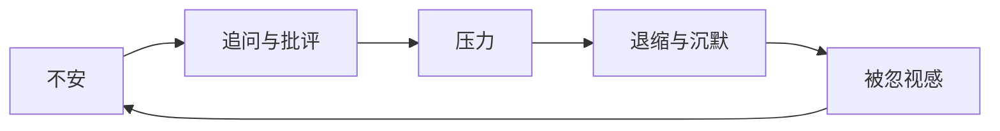

> 预计阅读时间：10 分钟

关系中最隐蔽的执取，是要求一个活生生的人保持符合我们的版本。我们说爱“这个人”，实际可能爱的是熟悉感、角色功能，以及对方如何让我们看待自己。

无常让爱听起来不安全，却也让爱变得真实：承诺的对象不是一个永不变化的形象，而是持续认识、协商和修复的过程。

## 冲突是一条回路

关系争执很少由单方静态性格解释。常见结构是：一方感到不安而追问，另一方感到被控制而退缩；退缩加重不安，追问随之升级。

双方都能拿出证据证明“是你先开始”。系统视角不急着找第一因，而问在哪里能打断循环。追问者可以表达脆弱需要而非指控，退缩者可以约定暂停后的返回时间，而非消失。

## 从本质判断到条件描述

“你很冷漠”把一次模式变成人格本质；“当我讲到困难、你看手机时，我感到没有被听见”保留了事件、影响和请求。

这并不保证对方合作，却提高了信息质量。非暴力沟通的价值不在温柔措辞，而在区分：

- 观察与评判；
- 感受与推测；
- 需要与策略；
- 请求与命令。

## 爱与不执取

不执取常被误解为“不需要你”。更成熟的表达是：“我珍惜你，但不把你变成解决我全部不安的工具。”

健康依赖与占有的区别，在于是否允许对方拥有主体性。你可以有需要，可以请求承诺，也可以在边界被反复破坏时离开；但不能因为需要，就把控制合理化。

> [!WARNING]
> 系统视角不应模糊虐待责任。存在暴力、威胁或控制时，优先考虑安全、外部支持与专业帮助。

## 记忆不是关系档案

冲突时，大脑会选择性提取符合当前情绪的证据。“你总是”“你从不”常是记忆被情绪重新索引的结果。建立具体记录、定期复盘和在平静时讨论规则，能减少当下状态垄断整个关系历史。

## 投资与工作的映照

关系与投资都需要区分波动与基本面：一次坏情绪未必说明关系坏，但长期蔑视和失信是结构信号。关系与工作也都存在沉没成本：投入多年不是继续受伤的充分理由。过去值得尊重，未来仍需独立判断。

## 实践：修复对话

选择一个低强度分歧，按顺序表达：

1. **事实**：我观察到……
2. **感受**：我感到……
3. **意义**：我发现自己把它解释成……
4. **需要**：我重视……
5. **请求**：你是否愿意……
6. **好奇**：你经历的版本是什么？

最后共同写下一个可观察的小实验，而不是要求人格彻底改变。

---

## One Sentence Summary

关系中的正见，是看见双方都在变化、冲突由互动生成，并以清晰边界和持续修复代替本质化判断。

---

## Key Takeaways

- 爱的对象是变化中的人，不是固定角色。
- 冲突常由双方相互触发的反馈回路维持。
- 条件描述比人格标签更准确、更可修复。
- 不执取允许需要存在，但拒绝把需要升级为控制权。
- 系统分析不能取消对暴力和伤害的个人责任。

---

## Reflection

1. 你希望亲近的人永远维持哪个旧版本？
2. 你所在的冲突回路中，自己的可改变动作是什么？
3. 哪项请求其实被你表达成了命令？

---

## Further Reading

- John Gottman：《幸福的婚姻》
- Marshall Rosenberg：《非暴力沟通》
- Sue Johnson：《依恋的形成》

---

## Next Chapter

[实践：把正见变成每日可重复的动作](#chapter-practice)
