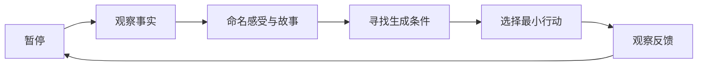

> 预计阅读时间：11 分钟

理解是一种状态，练习才会形成特质。读到“情绪不是事实”时点头很容易；在被冒犯的十秒内记得这件事，才是能力。

练习的目的不是时刻平静，而是缩短“被自动反应接管”到“重新看见选择”的时间。

## 正见的最小循环

这条循环可用于一次冲动购买、一场会议、一次争吵或一项投资。关键不在步骤复杂，而在重复频率。

## 每日五分钟

每天固定一个时段，选择当天最强烈的事件：

1. **事实**：不使用形容词，写三句摄像机可记录的内容。
2. **身体**：感受位于哪里，强度多少。
3. **故事**：头脑在预测什么、要求什么。
4. **条件**：睡眠、环境、关系、历史经验如何参与。
5. **行动**：哪个动作最小、可逆、符合长期价值。

不要试图写得深刻。稳定记录比偶尔顿悟更能改变模式。

## 三种即时练习

### STOP

- **Stop**：停止自动动作。
- **Take a breath**：用一次呼吸建立间隔。
- **Observe**：观察身体、思想和环境。
- **Proceed**：按价值而非冲动继续。

### 概率化

把“肯定会失败”改成失败概率，并列出影响概率的条件。数字不必精确，它的功能是拆除绝对化。

### 反向条件

当你讨厌某个结果时，问它靠什么条件维持；当你渴望某个结果时，问它靠什么条件生成。注意力从情绪对象转向可操作结构。

## 每周无常审计

每周用二十分钟检查四个领域：

| 领域 | 观察问题 |
|---|---|
| 身体 | 哪个信号发生变化，需要照顾 |
| 工作 | 哪项假设已经过期 |
| 金钱 | 哪个风险集中度在上升 |
| 关系 | 哪个连接需要维护或修复 |

再写一件应该结束的事和一件值得珍惜的事。接受变化不是只练习放手，也练习在尚未失去时看见价值。

## 决策日志

重要选择发生前记录：

- 我知道什么、不知道什么；
- 最可能、最好、最坏情景；
- 哪些因素可控；
- 失败是否可逆；
- 哪些证据会让我更新；
- 这是价值驱动，还是身份防御。

三个月后复盘时，不只看结果，还看当时信息下的过程质量。这样可以避免用运气奖励坏决策。

## 练习的陷阱

第一，把平静当成绩效。越监控自己是否平静，越容易焦虑。第二，把观察变成拖延，有时最清醒的动作就是立刻离开危险。第三，把练习变成优越身份，“我比别人觉察”本身就是新的执取。

> [!TIP]
> 一个练习是否有效，不看它让你显得多平静，而看它是否让你更诚实、更负责、更能根据反馈调整。

## 30 天路径

- **第 1 周**：只区分事实与解释。
- **第 2 周**：为强烈情绪识别身体感受和条件。
- **第 3 周**：每天做一个小型可逆试验。
- **第 4 周**：审查一个重要身份和一项长期承诺。

每周只增加一层，减少“学会全部”的渴求。

---

## One Sentence Summary

正见的实践，是反复在事实、故事与行动之间建立间隔，让更新模型逐渐比保护身份更自然。

---

## Key Takeaways

- 练习的目标是缩短自动反应持续时间，而非永远平静。
- 五分钟记录能把抽象概念落到具体事件。
- 概率、条件和可逆性是日常决策的三种有力工具。
- 复盘应评价过程，而非只评价结果。
- 哲学练习若制造优越身份，就偏离了它要解决的问题。

---

## Reflection

1. 哪个触发点最需要你建立十秒间隔？
2. 你会用什么固定线索启动每日五分钟练习？
3. 哪项长期承诺需要一次无常审计？

---

## Further Reading

- James Clear：《原子习惯》
- Annie Duke：《复盘》
- Jon Kabat-Zinn：《正念，此刻是一枝花》

---

## Next Chapter

[总结：一套不确定世界里的现实操作系统](#chapter-summary)
