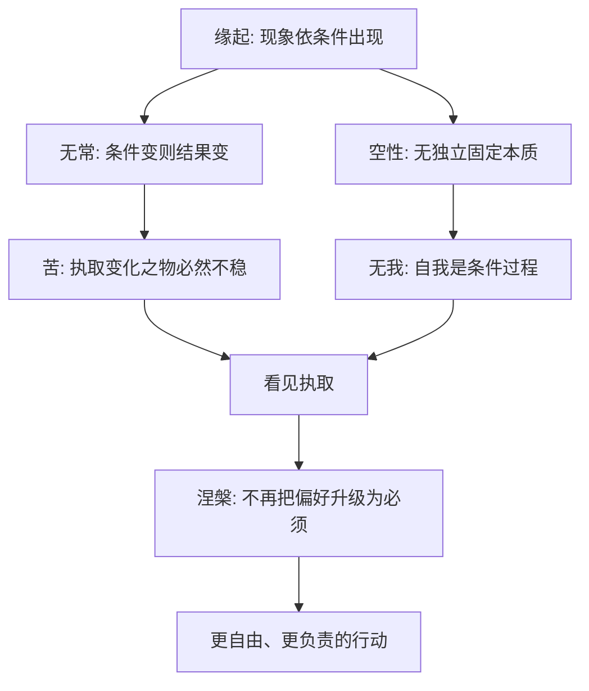

> 预计阅读时间：9 分钟

正见没有替我们回答该买哪只股票、选择哪份工作、是否结束一段关系。它做了一件更基础的事：改善提出问题的方式。

我们不再只问“怎样保证成功”，而问条件是什么、失败是否可逆；不再只问“我到底是什么人”，而问哪些行为和关系正在塑造我；不再只问“怎样永远快乐”，而问为何要求一种感受永久停留。

## 一条完整推理链

这条链最重要的转折是：看见条件性并不会削弱行动，反而使行动成为可能。若人格固定，成长无意义；若公司具有永恒本质，研究条件无意义；若关系命中注定，沟通和边界都无意义。

它也改变了“智慧”的定义。智慧不再是积累足够多、足以覆盖所有情境的答案，而是知道答案依赖哪些前提，知道何时应该更新，并能在没有把握时控制行动代价。知识让人拥有更多模型；正见让人不被任何一个模型永久绑住。

## 六条操作原则

### 1. 把事实、解释和价值分开

事实需要核对，解释需要比较，价值需要选择。三者混在一起，争论就会失焦。

### 2. 把“是什么”改成“如何生成”

少问“他是不是坏人”，多问哪些行为、激励与互动制造结果。这不取消责任，而是让干预更精确。

### 3. 为错误保留生存空间

组合分散、职业选择权、关系中的暂停机制，本质都在承认模型会错。

### 4. 使用身份，不被身份占有

身份可以组织行动，不能阻止证据进入。你可以是投资者、作者或伴侣，但任何角色都不是全部的你。

### 5. 高投入，低占有

认真准备、真诚承诺、持续维护，同时承认结果由多种条件共同决定。

### 6. 用反馈更新，而非用结果审判

一次输赢无法完整评价决策。复盘当时信息、概率与过程，才能真正学习。

## 同一框架，三个决定

假设你同时面对一项投资、一份工作机会和一段关系分歧。对象不同，检查顺序可以相同。

先看**事实与故事**。价格下跌是事实，“市场证明我愚蠢”是故事；收到新 offer 是事实，“错过就再无机会”是故事；对方取消约会是事实，“他从不重视我”仍需验证。

再看**生成条件**。资产依赖什么现金流与流动性，岗位依赖什么组织和经理，冲突依赖什么疲惫、沟通与旧经验。条件地图会把一个巨大判断拆成多个可检查假设。

然后看**不可逆代价**。高杠杆、烧毁职业关系、在愤怒中说出无法收回的话，都比保留观察空间危险。决策理论不要求永远谨慎，而是让投入尺度与证据强度匹配。

最后看**身份绑定**。你是在维护投资逻辑，还是“我很会投资”的形象？是在选择工作，还是害怕不再拥有某个头衔？是在解决分歧，还是必须赢得人格上的正当？

完成这四步，答案仍可能不明确。但不确定性已从一团焦虑变成几个可以等待、试验或承担的变量。正见不消灭艰难选择，它改善选择的形状。

## 何时停止分析

持续观察也可能成为逃避。信息价值低于等待成本时，就该行动；安全受到威胁时，先离开再理解；小而可逆的选择，不值得用终极哲学审判。

可以使用一个简单停止规则：已有足够信息排除灾难性结果，选择与核心价值一致，失败代价可承受，并且继续思考只是在重复同一组理由。此时行动本身会提供下一批信息。

## 一张现实检查表

| 遇到问题时 | 正见问题 |
|---|---|
| 情绪很强 | 我感受到什么，又添加了什么故事 |
| 结果不如预期 | 哪个条件或假设发生变化 |
| 无法放手 | 我在保护价值，还是保护身份 |
| 责怪某个人 | 哪个互动结构在重复制造行为 |
| 必须做选择 | 什么可逆，什么可能造成永久损失 |
| 一切顺利 | 哪些维护被成功暂时遮蔽 |

## 正见的伦理含义

若自我和结果都依条件而生，我们会更少用本质标签侮辱人，也更重视设计公平条件。理解一个人受环境影响，不意味着认可伤害；它意味着惩罚之外，还要改变让伤害重复的结构。

无我也不是让个人消失，而是扩大责任边界：我的行动进入他人的条件，我的消费、管理和表达都会参与制造一个系统。

## 最后的悖论

人想通过掌握正见获得确定性，但正见恰恰让我们放下对确定性的迷恋。它不是一个让世界服从的终极模型，而是一套防止模型僵化的纪律。

> [!NOTE]
> 真正的“看见”往往没有戏剧性：只是下一次被冒犯时晚十秒回应，下一次上涨时少一点自信，下一次失败时不急着定义自己。

## 最后一次练习

回到[全书导览](#chapter-index)开头那件令你焦虑的事。重新写三列事实、解释和要求，然后增加两列：

- **条件**：什么让它发生和持续？
- **行动**：哪个最小动作既承认现实，又符合价值？

比较第一次与现在的答案。如果故事变短、条件变多、行动变小而具体，这套阅读已经开始发挥作用。

---

## One Sentence Summary

正见是一套面向不确定性的现实操作系统：看见条件、允许变化、松开身份，并以可更新的方式认真行动。

---

## Key Takeaways

- 四法印、缘起与空性构成一条统一推理链。
- 条件性不是消极理由，而是行动和改变的前提。
- 好决策让错误可承受、让反馈可进入。
- 成熟不是没有偏好，而是不把偏好升级为世界必须履行的合同。
- 正见最终体现在更小、更诚实、更负责的日常动作里。

---

## Reflection

1. 这套框架改变了你对哪个问题的提问方式？
2. 你愿意松开的第一个“必须”是什么？
3. 一年后的你，希望今天开始维护哪组条件？

---

## Further Reading

- 宗萨蒋扬钦哲：《正见》
- Donella Meadows：《系统之美》
- Daniel Kahneman：《思考，快与慢》
- Nassim Nicholas Taleb：《反脆弱》
- Oliver Burkeman：《四千周》

---

## Next Chapter

[返回全书导览，选择一个主题重读](#chapter-index)
