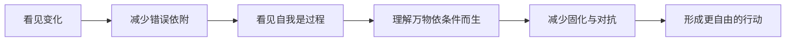

# 《正见：在不确定世界里看清现实》

这不是原书摘要，也不是佛学术语手册。它是一部独立的阅读作品：以宗萨蒋扬钦哲在《正见》中讨论的“四法印”为起点，连接认知心理学、行为经济学、系统思维、复杂性科学与决策理论，回答一个更日常的问题：

> 如果世界持续变化、情绪并不可靠、自我是过程而非实体，我们该怎样生活和选择？

## 为什么写这个系列

许多痛苦不是因为缺少信息，而是因为我们拿着错误的世界模型：把暂时当永久，把感受当事实，把身份当本质，把控制感当控制力。正见的价值不在于提供新的信仰，而在于帮助我们发现模型与现实之间的误差。

## 适合谁

- 对哲学、心理学和理性思考感兴趣，但没有佛学背景的人
- 想理解长期主义、风险与市场周期的投资者
- 正在经历职业变化、关系冲突或身份转型的人
- 希望把“知道”变成日常练习的人

全系列约需 90–120 分钟。可以顺序阅读，也可以从最相关的主题进入。

## 阅读顺序

1. **建立地图**：导览、作者与“正见”的含义
2. **理解四法印**：无常、苦、无我、涅槃
3. **补足机制**：缘起与空性
4. **进入现实**：心理、投资、工作、关系与练习

## 知识地图

| 概念 | 现代语言 | 实际问题 |
|---|---|---|
| 无常 | 非平稳系统、熵、周期 | 为什么好事和坏事都会变 |
| 苦 | 奖励预测误差、享乐适应 | 为什么得到后仍不满足 |
| 无我 | 叙事自我、模块化心智 | 为什么身份会困住选择 |
| 缘起 | 因果网络、反馈回路 | 为什么单一归因常常失败 |
| 空性 | 关系性、反本质主义 | 为什么标签有用但不是真相 |
| 涅槃 | 解除错误绑定 | 如何在行动中不被结果占有 |

## 编辑原则

- 不复制原书长段落，不逐章改写。
- 对传统概念做现代类比，但不声称两者完全等同。
- 区分事实、解释与练习；不把哲学包装成医疗建议。
- 每章都回到“所以呢”，让理解改变下一次选择。

开始阅读：[全书导览](#chapter-index)。
