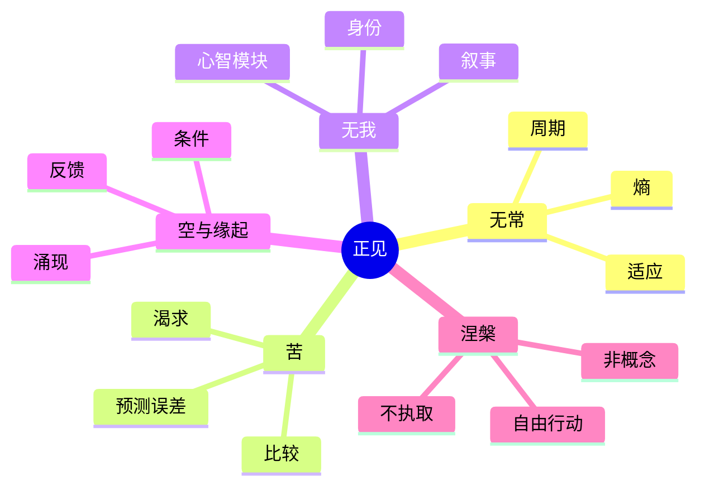

> 预计阅读时间：8 分钟

我们以为人生的主要问题是“怎样得到想要的东西”。更深的问题其实是：**我们用什么模型判断一件东西值得得到？**

模型如果错了，努力只会更高效地把人带向错误方向。把职位当作永久身份，会让一次裁员变成自我崩塌；把上涨当作资产的天性，会让周期顶部看起来最安全；把伴侣一时的语气当作人格本质，会把一次摩擦升级成关系判决。

《正见》有一个锋利的主张：判断一种思想是否接近佛教的核心，不看服饰、仪式或生活方式，而看它是否承认四个事实——一切和合事物都变化；被执取的情绪带来不满足；现象没有独立不变的本质；自由不在概念制造的对立里。

本系列不要求读者成为佛教徒。我们把这四点当成四个需要检验的现实假设。

## 一张地图

这些概念不是彼此孤立的教条，而是一条推理链：

1. 事物由条件构成，所以会随条件变化。
2. 我们却要求变化中的事物提供稳定保证。
3. 当现实偏离要求，渴求、焦虑和对抗就出现。
4. 执取背后还有一个假设：存在一个必须被维护的固定“我”。
5. 看见“我”和“事物”都是动态关系，不等于否定它们，而是停止把它们绝对化。

> [!NOTE]
> 正见不是“正确答案的清单”，而是校正观察方式。它更像更新操作系统，而不是安装一个观点。

## 为什么现代人仍需要它

现代生活扩大了选择，也扩大了错误模型的代价。推荐算法把欲望变成无限滚动；职业平台把身份压缩成履历；金融市场每天给资产报价，让波动看起来像价值本身；社交媒体让比较对象从邻居扩展到全世界。

行为经济学告诉我们，人会损失厌恶、追逐近期趋势、保护既有立场。认知心理学告诉我们，知觉并非被动摄像，而是大脑根据过去经验进行预测。复杂性科学提醒我们，线性原因很少能解释网络中的结果。正见与这些知识并不相同，却指向相似的纪律：**不要把头脑生成的解释误认成现实本身。**

## 四种现实测试

| 当你遇到…… | 先问什么 | 避免什么 |
|---|---|---|
| 投资暴涨 | 哪些条件支撑它，条件能持续吗 | 把价格趋势当本质 |
| 职业受挫 | 这是能力反馈，还是身份判决 | 用一次结果定义自己 |
| 关系冲突 | 情绪由哪些条件共同生成 | 把感受当证据 |
| 重大选择 | 哪些假设可逆、哪些代价不可逆 | 追求虚假的确定性 |

## 怎样阅读

先读[前言](#chapter-preface)和[什么是正见](#chapter-right-view)，再依次理解四法印。若你更关心应用，可以直达[投资](#chapter-investing)、[工作](#chapter-work)、[关系](#chapter-relationships)或[实践](#chapter-practice)。但应用章不能代替概念章：技巧只有在世界模型改变后，才不容易退化成新的自我控制游戏。

> [!WARNING]
> 本系列提供哲学与认知工具，不替代心理治疗、医疗诊断或专业投资建议。

## 一个起始练习

选一件最近让你焦虑的事，写下三列：

- **事实**：摄像机能够记录什么？
- **解释**：我给事实加了什么意义？
- **要求**：我暗中要求什么必须保持不变？

仅仅分开这三层，很多“命运判决”就会还原成“某些条件下发生的一件事”。

---

## One Sentence Summary

正见是一套减少模型误差的认知纪律：先如实看见条件、变化和执取，再决定如何行动。

---

## Key Takeaways

- 四法印是一条相互支撑的推理链，不是四句口号。
- 痛苦经常来自对现实提出了它无法长期履行的稳定承诺。
- 现代心理学与系统思维能帮助解释机制，但不能取代亲自观察。
- 阅读的目标不是获得佛学身份，而是提高现实感。

---

## Reflection

1. 你当前最依赖哪一种“必须不变”的条件？
2. 最近一次强烈情绪中，事实和解释分别是什么？
3. 如果身份只是暂时角色，你会重新考虑哪个选择？

---

## Further Reading

- 宗萨蒋扬钦哲：《正见》
- Daniel Kahneman：《思考，快与慢》
- Donella Meadows：《系统之美》
- Stanford Encyclopedia of Philosophy：Buddhist Philosophy 相关条目

---

## Next Chapter

[前言：不是相信，而是看清](#chapter-preface)
